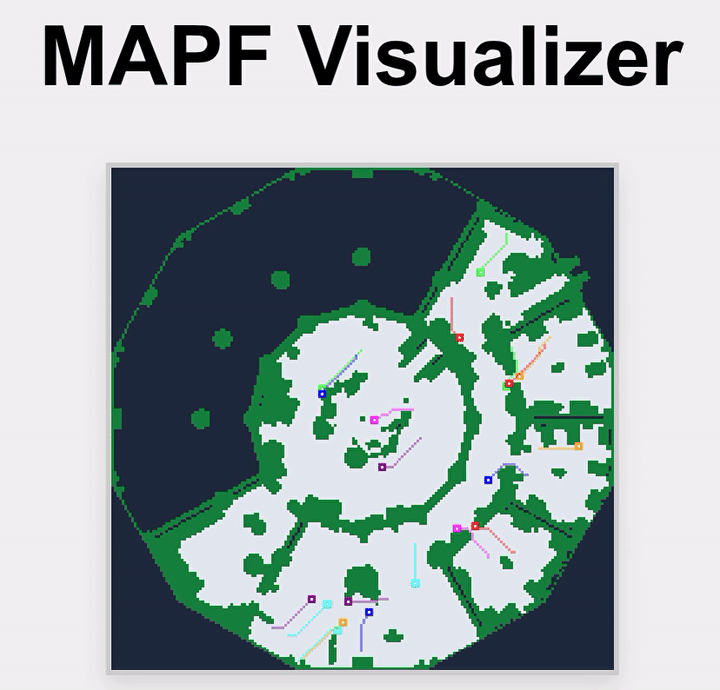

# Conflict-Based-Search

An implementation of the Conflict Based Search algorithm for MAPF(Multi Agent Path Finding) with a web visualizer.



>Note: The visualizer can be run without compiling because it already contains a `solution.json`

## Local Setup

1. Install `vcpkg` (e.g., at `~/vcpkg`):

   ```sh
   git clone https://github.com/microsoft/vcpkg.git ~/vcpkg
   ~/vcpkg/bootstrap-vcpkg.sh
   ```

2. Building from the `cpp_files` directory:

   ```sh
   cd cpp_files
   cmake -B build -S . -DCMAKE_TOOLCHAIN_FILE=~/vcpkg/scripts/buildsystems/vcpkg.cmake -GNinja
   cmake --build build
   ```

3. Run the tests:

   ```sh
   ./build/cbs_tests
   ```

## Using Docker

1. Building the Docker image:

   ```sh
   docker build -t cbs-project .
   ```

2. Running the interactive executable:

   ```sh
   docker run -it cbs-project /bin/sh -c "cd cpp_files/build && ./ConflictBasedSearch"
   ```

## Running the Visualizer

After getting the `solution.json` file using the `ConflictBasedSearch` executable, you can view the paths rendered in your browser.

1. Start a local server:

   ```sh
   cd visualizer
   python3 -m http.server 8080
   ```

2. Open your web browser and go to `http://localhost:8080`.

## Benchmarks

The path planner was benchmarked on the `ost003d` map using a random scenario:

| Number of Agents | Execution Time | Status |
| :---: | :---: | :---: |
| 1 | 3 ms | Optimal Path Found |
| 2 | 5 ms | Optimal Path Found |
| 3 | 8 ms | Optimal Path Found |
| 5 | 13 ms | Optimal Path Found |
| 8 | 20 ms | Optimal Path Found |
| 10 | 24 ms | Optimal Path Found |
| 12 | 268 ms | Optimal Path Found |
| 15 | 343 ms | Optimal Path Found |
| 20 | 733 ms | Optimal Path Found |
| 25 | Timeout (> 4 min) | Conflict space too dense |
